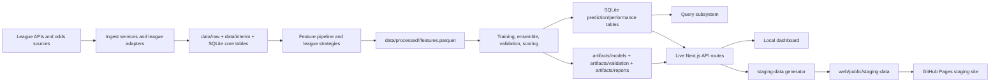

# SportsModeling Project Organization Deep Dive

## Purpose, audience, and non-goals

This document is a reviewer-oriented map of how the `SportsModeling` repository is organized. It is written for an external evaluator, another model, or a new contributor who needs enough context to critique the setup without first reverse-engineering the repository.

The document focuses on:

- the system's intended product shape
- the repo's module boundaries
- how data flows from source APIs to forecasts and dashboard views
- how league-specific behavior is isolated
- how the web app and static staging site are related
- where the strongest architectural ideas are
- where the most likely stress points or cleanup opportunities are

It is intentionally more detailed than a normal README.

This document is not:

- a code audit
- a prediction-quality evaluation
- a security review
- a production-readiness certification
- a line-by-line inventory of every file in the repository

Operating assumptions that matter while reading:

- the repository is local-first and operator-driven
- the dashboard is closer to an internal product/workbench than a public multi-tenant service
- GitHub Pages staging is snapshot-based, not live
- SQLite is the canonical local persistence layer

## Critical invariants

These are the main truths a reviewer should hold in mind while reading the rest of the document:

- `src/registry/*` is the canonical metadata layer for leagues, commands, models, dashboard routes, and subsystem docs.
- Generated artifacts under `configs/generated/`, `docs/generated/`, and `web/lib/generated/` are derived from those registries and should not become competing sources of truth.
- The local dashboard reads live SQLite-backed data through Next.js API routes and server-side services.
- The GitHub Pages staging site reads committed JSON snapshots from `web/public/staging-data/`; it does not read live SQLite data.
- `predictions` stores frozen pregame records that actually existed before games, while `prediction_diagnostics` stores synthetic replay, OOF, and backtest outputs.
- League-specific behavior should live in adapters, strategies, or named policies, not inside shared orchestration modules.
- Production, validation, and research are adjacent execution surfaces, but they are intentionally distinct and should not be treated as the same thing.

## 60-second architecture map

The shortest accurate description of the system is:

1. Python ingest code fetches league data and odds, saves raw snapshots, normalizes them into interim tables, and persists core entities into SQLite.
2. Shared feature-pipeline code plus league-specific strategies build `features.parquet` into league-scoped processed directories.
3. Training code fits model families, builds ensemble forecasts, persists frozen predictions, and writes validation and scoring outputs.
4. A deterministic query layer answers product-style questions from persisted data.
5. A Next.js dashboard reads the same persisted outputs through live API routes.
6. A separate staging-data generator calls those same route handlers and writes committed JSON snapshots for GitHub Pages.

If a reviewer remembers only one relationship map, it should be this:

- hand-authored Python registries -> generated manifests/docs/TS metadata
- live ingest/features/train/validate -> SQLite + artifact outputs
- live dashboard -> SQLite-backed API payloads
- staging site -> committed JSON snapshots generated from those payloads

## Reviewer checklist

If you want to use this document as a review instrument, these are the main questions to keep in mind while reading:

- Are the registries actually canonical, or can generated artifacts drift into semi-authoritative duplicates?
- Is the `predictions` vs `prediction_diagnostics` distinction enforced strongly enough to preserve historical integrity?
- Are production, validation, and research boundaries encoded in the architecture, or mostly conventional?
- Are shared cross-league abstractions truly neutral, or still carrying NHL-shaped naming and assumptions?
- Is too much orchestration concentrated in a few mutation-heavy modules like ingest, train, and performance services?
- Is the web layer an appropriate home for replay, betting, and control-plane logic, or is it accumulating too much domain behavior?
- Does the live-vs-staging split reduce drift, or create too much additional operational ceremony?

## What this project is

At a high level, this repo is a multi-league sports forecasting platform for:

- NHL
- NBA
- NCAA men's basketball (`NCAAM`)

The system is not just a collection of prediction scripts. It is a full local product stack with:

- raw data ingestion
- normalized SQLite persistence
- feature engineering
- model training and ensembling
- scoring and validation
- betting-history and profitability analysis
- a deterministic question-answer interface over persisted data
- a local Next.js dashboard
- a separate GitHub Pages staging snapshot system

The repository is opinionated about two things:

1. Cross-league support should share as much structure as possible.
2. Forecasting is only useful if it feeds product surfaces like betting decisions, validation views, historical replay, and dashboard payloads.

## Core product mental model

The cleanest way to understand the repo is as five connected layers:

1. `Ingest and normalize sports/odds data`
2. `Build league-aware feature tables`
3. `Train model families and ensemble them`
4. `Persist forecasts, scores, validation outputs, and replayable history`
5. `Expose those outputs through queries, APIs, and dashboard pages`

That flow is visible in both the Python pipeline and the web app.

The practical daily path is roughly:

1. Fetch league data and odds into `data/raw/`, `data/interim/`, and SQLite
2. Build `features.parquet` into `data/processed/<league>/`
3. Train models and write forecasts, diagnostics, and artifacts
4. Score frozen pregame predictions against final results
5. Serve the latest outputs through the CLI query layer and the dashboard

## Top-level repository layout

These are the top-level directories that matter most:

- `src/`: the Python application and model pipeline
- `web/`: the Next.js dashboard and its server/data-access layer
- `configs/`: league configs, feature registries, model feature maps, and guardrails
- `configs/generated/`: generated manifests shared by Python, docs, and the web app
- `data/`: raw snapshots, interim tables, and processed league outputs
- `artifacts/`: trained-model artifacts, reports, validation outputs, archived validation runs, and research outputs
- `docs/generated/`: generated architecture, command, manifest, and route references
- `tests/`: Python test suite
- `statistical_theory/`: durable modeling notes and supporting theory documents
- `scripts/`: shell and export helpers

The repo also has a generated-documentation mindset. Several docs and manifests are produced from code-first registries rather than handwritten by hand.

## Source-of-truth map

The repo has several important metadata and data surfaces. The table below is the quickest way to understand which ones are canonical and which ones are derived.

| Surface | Hand-authored or generated | Canonical owner | Main consumers | Regeneration or update trigger |
| --- | --- | --- | --- | --- |
| [src/registry/leagues.py](src/registry/leagues.py) | hand-authored | Python registry layer | CLI defaults, config resolution, web generated metadata, docs | `make docs-generate` after changes |
| [src/registry/commands.py](src/registry/commands.py) | hand-authored | Python registry layer | `src/cli.py`, generated command docs, tests | `make docs-generate` after changes |
| [src/registry/models.py](src/registry/models.py) | hand-authored | Python registry layer | training catalog, reports, generated model manifest, web generated metadata | `make docs-generate` after changes |
| [src/registry/dashboard_routes.py](src/registry/dashboard_routes.py) | hand-authored | Python registry layer | route manifest, staging generation, generated TS route metadata, docs | `make docs-generate` after changes |
| [configs/*.yaml](configs) | hand-authored | config layer | ingest, training, validation, orchestration | edited directly |
| [configs/feature_registry_*.yaml](configs) | hand-authored but policy-managed | feature governance layer | training feature-policy enforcement | direct edit or approved feature-policy update |
| [configs/model_feature_map_*.yaml](configs) | hand-authored but research-promoted | model feature selection layer | training, web feature summaries | `make research-features ... APPROVE_FEATURE_CHANGES=1` or direct edit |
| [configs/model_feature_guardrails_*.yaml](configs) | hand-authored | training guardrail layer | training feature validation | edited directly |
| [configs/generated/*.json](configs/generated) | generated | registry + feature-research outputs | Python manifest readers, tests, web generated metadata | `make docs-generate` or feature-research promotion |
| [docs/generated/*.md](docs/generated) | generated | registry layer | human reviewers | `make docs-generate` |
| [web/lib/generated/*.ts](web/lib/generated) | generated | registry layer | web runtime | `make docs-generate` |
| `data/raw/` | generated runtime data | ingest layer | ingest auditing and offline cache behavior | `fetch`, `refresh-data`, `data_refresh`, `hard_refresh` |
| `data/interim/<league>/` | generated runtime data | ingest layer | feature pipeline | ingest commands |
| `data/processed/<league>/features.parquet` | generated runtime data | feature pipeline | training, research, validation | `features` or daily/full pipeline runs |
| `data/processed/*_forecast.db` | generated runtime data | storage layer | query subsystem, live dashboard, scoring, validation | init-db, ingest, training, scoring |
| `artifacts/models/` | generated runtime data | training layer | validate, run replay, model inspection | `train`, `backtest`, research flows |
| `artifacts/validation/` | generated runtime data | evaluation/validation layer | validation API and local review | `train` and `validate` |
| `artifacts/validation-runs/` | generated runtime data | evaluation/validation layer | archived validation review | `train` and `validate` |
| [web/public/staging-data/](web/public/staging-data) | generated but committed | web staging snapshot layer | GitHub Pages staging site | `cd web && npm run generate:staging-data` |

## The three major execution surfaces

There are three separate but connected execution surfaces in this repo:

### 1. Python CLI pipeline

The Python CLI is the operational backbone. It handles:

- DB initialization
- ingest
- odds refreshes
- feature building
- model training
- validation
- backtesting
- research model comparison
- deterministic daily runs

Main entrypoints:

- `src/cli.py`
- `src/commands/`
- `src/services/`
- `Makefile`

### 2. Local dashboard

The local dashboard is a full Next.js app that reads the repo's SQLite outputs and exposes them through API routes and client pages.

Main entrypoints:

- `web/app/`
- `web/app/api/`
- `web/lib/server/`
- `web/lib/`

### 3. Static staging site

The staging site is not the live local dashboard. It is a static GitHub Pages artifact that serves committed JSON snapshots from `web/public/staging-data/`.

This distinction is extremely important:

- local dashboard = live SQLite-backed product
- GitHub Pages staging = committed JSON snapshots built from local route handlers

That separation is a first-class architectural rule in the repo and affects how changes are shipped.

## Python application architecture

The Python side is organized more like an application platform than a flat modeling codebase.

### `src/common`

Cross-cutting utilities and typed configuration live here.

Key responsibilities:

- `src/common/config.py`: typed Pydantic config loading from YAML
- `src/common/manifests.py`: shared manifest loading
- `src/common/logging.py`: logging setup
- `src/common/time.py`: time helpers
- `src/common/utils.py`: file and JSON helpers
- `src/common/research.py`: research-specific helpers

Why it matters:

- config loading is centralized
- generated manifests can be consumed in one place
- shared runtime assumptions do not leak across modules

### `src/registry`

This is one of the most important architectural subsystems in the repo.

It defines code-first registries for:

- leagues
- commands
- models
- dashboard routes
- subsystem documentation metadata

Key files:

- `src/registry/leagues.py`
- `src/registry/commands.py`
- `src/registry/models.py`
- `src/registry/dashboard_routes.py`
- `src/registry/subsystems.py`
- `src/registry/generate.py`
- `src/registry/verify.py`

What this layer does:

- drives CLI parser generation
- drives generated command docs
- drives generated architecture docs
- drives generated dashboard route manifests
- drives generated TypeScript registry outputs for the web app

This is a strong anti-drift pattern. Instead of duplicating system metadata across Python, the web app, and docs, the repo generates those surfaces from one code-backed source of truth.

### `src/commands`

This layer is intentionally thin.

Responsibilities:

- receive parsed argparse arguments
- apply small argument overrides
- hand real work to services

Key files:

- `src/commands/data.py`
- `src/commands/modeling.py`
- `src/commands/smoke.py`
- `src/commands/__init__.py`

This is an example of a healthy boundary: the CLI entrypoint does not own business logic.

### `src/services`

This is the application orchestration layer.

Key responsibilities:

- ingest lifecycle
- training closeout
- validation closeout
- backtests
- historical import
- research comparison orchestration

Key files:

- `src/services/ingest.py`
- `src/services/train.py`
- `src/services/validate.py`
- `src/services/backtest.py`
- `src/services/model_compare.py`
- `src/services/research_backtest.py`
- `src/services/history_import.py`

This is where repository-level concerns live:

- loading feature contracts
- persisting outputs to DB
- writing artifacts
- triggering validation
- scoring predictions

### `src/storage`

This is the canonical persistence layer.

Key files:

- `src/storage/db.py`
- `src/storage/schema.py`
- `src/storage/prediction_history.py`
- `src/storage/tracker.py`

Responsibilities:

- own SQLite schema
- provide basic execute/query helpers
- apply online migrations
- enforce prediction-history contracts
- track artifact run metadata on disk

The most important persistence distinction in the repo is:

- `predictions` = frozen pregame forecasts that actually existed before games
- `prediction_diagnostics` = synthetic OOF, backtest, and replay predictions

That separation is crucial for trustworthy performance analysis and user-facing replay.

### `src/data_sources`

This layer owns source acquisition and source-specific parsing.

Structure:

- shared contracts in `src/data_sources/base.py`
- per-league modules under:
  - `src/data_sources/nhl/`
  - `src/data_sources/nba/`
  - `src/data_sources/ncaam/`

The repo standardizes a league adapter surface through `src/league_registry.py`, which makes each league look the same to the shared pipeline.

Shared adapter responsibilities include:

- fetch games
- fetch schedule
- fetch teams
- fetch players
- fetch injuries
- fetch odds
- fetch xG or similar optional stats
- build normalized results from raw game tables

Architecturally, this is the key move that lets NHL, NBA, and NCAAM share the same orchestration pipeline.

### `src/features`

This layer builds processed training data from the interim ingest tables.

Key files:

- `src/features/build_features.py`
- `src/features/pipeline.py`
- `src/features/leakage_checks.py`
- `src/features/strategies/nhl.py`
- `src/features/strategies/nba.py`
- `src/features/strategies/ncaam.py`

The feature pipeline is shared, but strategy objects inject league-specific behavior.

Shared stages include:

- load interim tables
- expand games into team-level views
- compute rolling windows
- merge back into game-level rows
- compute home-away difference features
- impute, finalize, and persist the feature frame

League-specific logic stays in strategy modules rather than inlined across the pipeline.

This is one of the repo's better structural decisions:

- common pipeline mechanics are shared
- league-specific semantics are explicit and named

### `src/models`

This directory contains model implementations, but model metadata lives elsewhere.

Representative files:

- `src/models/glm_ridge.py`
- `src/models/glm_elastic_net.py`
- `src/models/glm_lasso.py`
- `src/models/gbdt.py`
- `src/models/rf.py`
- `src/models/two_stage.py`
- `src/models/glm_goals.py`
- `src/models/bayes_state_space_bt.py`
- `src/models/bayes_state_space_goals.py`
- `src/models/nn.py`
- `src/models/ensemble_weighted.py`
- `src/models/ensemble_stack.py`

The canonical model registry lives in `src/registry/models.py`, not here.

That means:

- model code and model metadata are intentionally separated
- reporting order and aliases are centralized
- the web app can consume the same model catalog as the training code

### `src/training`

This is the core model execution layer.

Key responsibilities:

- selecting feature columns
- enforcing feature policy and guardrails
- fitting model families
- generating OOF predictions
- assembling ensembles
- generating upcoming forecasts
- applying uncertainty policies
- running prequential scoring

Key files:

- `src/training/train.py`
- `src/training/fit_runner.py`
- `src/training/predict_runner.py`
- `src/training/model_catalog.py`
- `src/training/feature_policy.py`
- `src/training/model_feature_guardrails.py`
- `src/training/model_feature_research.py`
- `src/training/ensemble_builder.py`
- `src/training/ensemble_policy.py`
- `src/training/prequential.py`
- `src/training/uncertainty_policy.py`

This subsystem is where most of the modeling sophistication lives.

### `src/evaluation`

This is the formal evaluation and validation subsystem.

Key responsibilities:

- validation pipelines
- GLM diagnostics
- calibration
- significance tests
- nonlinearity checks
- stability analysis
- fragility analysis
- influence analysis
- drift and change detection
- slice analysis

Key files:

- `src/evaluation/validation_pipeline.py`
- `src/evaluation/calibration.py`
- `src/evaluation/change_detection.py`
- `src/evaluation/diagnostics_glm.py`
- `src/evaluation/validation_significance.py`
- `src/evaluation/validation_nonlinearity.py`
- `src/evaluation/validation_stability.py`
- `src/evaluation/validation_fragility.py`
- `src/evaluation/validation_influence.py`
- `src/evaluation/research_betting.py`

This repo does not treat validation as a small afterthought. It has a real diagnostics surface.

### `src/query`

This is a product-facing deterministic question-answering layer over the local database.

Key files:

- `src/query/answer.py`
- `src/query/intent_parser.py`
- `src/query/parse.py`
- `src/query/team_handlers.py`
- `src/query/report_handlers.py`
- `src/query/bet_history_handlers.py`
- `src/query/championship_estimators.py`
- `src/query/team_aliases.py`

It answers questions like:

- next game win probability
- next few games
- championship heuristics
- bet history summaries
- P/L recap questions
- why a team was bet or skipped

This is not an LLM layer. It is a deterministic SQL-backed product-answering surface.

### `src/research`

This is explicitly separated from the production pipeline.

Key responsibilities:

- candidate model comparison
- broader experimentation
- historical research backtests

Key files:

- `src/research/model_comparison.py`
- `src/research/candidate_models.py`

This separation matters because the repo intentionally distinguishes:

- production models
- research candidates

### `src/orchestration`

This is the multi-league orchestration layer.

Key files:

- `src/orchestration/data_refresh.py`
- `src/orchestration/hard_refresh.py`
- `src/orchestration/refresh_pipeline.py`

Responsibilities:

- deterministic repo-wide data-only refresh
- deterministic repo-wide hard refresh
- sequential cross-league execution
- commit/push/workflow-watch automation for hard refreshes

The orchestration system reflects the repo's operational contract:

- supported leagues are run in a fixed order
- data refresh and hard refresh are repository-level workflows, not just per-league commands

## Configuration model

Config is YAML-based and typed through `src/common/config.py`.

Important files:

- `configs/default.yaml`
- `configs/nhl.yaml`
- `configs/nba.yaml`
- `configs/ncaam.yaml`

Important patterns:

- league configs extend `configs/default.yaml`
- paths are league-specific for interim/processed/db outputs
- research, feature policy, and runtime behavior are config-driven

There are also several config surfaces beyond the main league YAML files:

- `configs/feature_registry_<league>.yaml`
- `configs/model_feature_map_<league>.yaml`
- `configs/model_feature_guardrails_<league>.yaml`

These are not decorative files. They are active parts of the modeling contract.

## Generated manifests and why they matter

The repo has a strong generated-manifest pattern.

Generated outputs include:

- `configs/generated/league_manifest.json`
- `configs/generated/model_manifest.json`
- `configs/generated/command_manifest.json`
- `configs/generated/dashboard_route_manifest.json`
- `configs/generated/model_feature_map_<league>.json`
- `docs/generated/architecture.md`
- `docs/generated/commands.md`
- `docs/generated/dashboard-routes.md`
- `docs/generated/extensions.md`
- `web/lib/generated/*.ts`

Why this is valuable:

- Python and TypeScript read the same canonical metadata
- docs and tests can verify the repo against generated truth
- adding a league, model, or route is more mechanical and less error-prone

This is one of the most mature structural features in the project.

## Command and execution model

The CLI parser is built from the command registry rather than manually coded.

Main flow:

1. `src/cli.py` builds argparse from `src/registry/commands.py`
2. `src.commands.dispatch()` resolves the handler
3. thin command modules call service functions
4. services mutate the DB, files, and artifacts

Core commands include:

- `init-db`
- `fetch`
- `refresh-data`
- `fetch-odds`
- `import-history`
- `features`
- `research-features`
- `train`
- `validate`
- `compare-candidates`
- `backtest`
- `research-backtest`
- `run-daily`
- `smoke`

The `Makefile` acts as the main human-facing wrapper around these commands.

It also exposes higher-level repo workflows:

- `make data_refresh`
- `make hard_refresh`
- `make docs-generate`
- `make verify`
- `make dashboard`

Two repository-level workflows are especially important in this codebase:

### `make data_refresh`

This is the deterministic multi-league data-only refresh.

Intent:

- fetch fresh league data
- fetch a final fresh odds snapshot for each league
- stop before features, training, or staging regeneration

### `make hard_refresh`

This is the deterministic multi-league refresh/train/publish workflow.

Intent:

- initialize DBs
- fetch league data
- fetch a final fresh odds snapshot for each league
- train each league from the current processed feature snapshot
- regenerate staging data
- optionally build Pages output
- commit and push results
- watch the GitHub Actions publish workflow

Operationally, that tells you this repo treats multi-league refreshes as first-class product workflows rather than ad hoc shell scripts.

## League and runtime model

League identity is registry-backed rather than being scattered across the codebase.

Important files:

- `src/registry/leagues.py`
- `src/league_registry.py`

There are two related ideas here:

### `src/registry/leagues.py`

This is the canonical metadata registry for supported leagues. It defines, per league:

- code
- slug
- display label
- default config path
- config env var
- project name
- default DB path
- DB env var
- championship naming
- uncertainty policy naming

### `src/league_registry.py`

This is the typed adapter layer that maps shared orchestration code to per-league implementations.

It exposes a normalized league adapter with methods like:

- fetch games
- fetch players
- fetch injuries
- fetch schedule
- fetch teams
- fetch odds
- fetch xG
- build results from games

This is one of the main reasons the repo can support NHL, NBA, and NCAAM without triplicating the orchestration layer.

The canonical orchestration order is:

1. NHL
2. NBA
3. NCAAM

That order matters for repo-level refresh workflows and cross-league operational consistency.

## End-to-end data flow

The end-to-end pipeline looks like this:

1. Shared ingest orchestration in `src/services/ingest.py`
2. League-specific fetch adapters in `src/data_sources/<league>/`
3. Raw snapshot persistence into `data/raw/` plus `raw_snapshots`
4. Normalized interim tables into `data/interim/<league>/`
5. Feature build into `data/processed/<league>/features.parquet`
6. Model train/predict into `artifacts/models/` and `artifacts/reports/runs/`
7. Forecast and metadata persistence into SQLite tables such as:
   - `predictions`
   - `upcoming_game_forecasts`
   - `model_runs`
   - `model_scores`
   - `performance_aggregates`
   - `change_points`
8. Validation outputs into:
   - `artifacts/validation/<league>/`
   - `artifacts/validation-runs/<league>/...`
9. Dashboard APIs and query handlers read those persisted outputs
10. Staging snapshot generation materializes selected API payloads into `web/public/staging-data/`

This persistence-first architecture is important. The web app and query layer generally read persisted outputs rather than recomputing model behavior on demand.

## Persistence cheat sheet

Because the architecture is persistence-first, these are the tables and directories a reviewer should care about most:

| Store | Meaning | Written by | Read by |
| --- | --- | --- | --- |
| `raw_snapshots` | audit trail for fetched source payloads and snapshot metadata | ingest | debugging, provenance, freshness reasoning |
| `games` | normalized scheduled and completed games | ingest | feature pipeline, odds matching, dashboard/services |
| `results` | normalized final outcomes | ingest | scoring, bet-history logic, validation context |
| `odds_snapshots` / `odds_market_lines` | normalized market history and bookmaker lines | ingest / odds refresh | market-board, games-today, bet history, research betting |
| `predictions` | frozen pregame predictions that really existed before games | train closeout | production scoring, replay, product answers, dashboard |
| `prediction_diagnostics` | synthetic OOF, backtest, and replay diagnostics | train/backtest/research flows | diagnostics and offline analysis |
| `upcoming_game_forecasts` | latest user-facing upcoming forecast surface | train closeout | query handlers, live dashboard API payloads |
| `model_runs` | trained-run metadata and artifact references | train closeout | validation reload, web run summaries, provenance |
| `model_scores` | per-game/per-model realized scoring records | scoring | performance summaries and analysis |
| `performance_aggregates` | summarized rolling or aggregate performance records | scoring | query/reporting/dashboard performance views |
| `change_points` | detected regime or performance shifts | scoring/change detection | performance analysis surfaces |
| `validation_results` | validation metadata and pointers | validation | validation APIs and summaries |
| `data/interim/<league>/` | normalized ingest-stage files | ingest | feature pipeline |
| `data/processed/<league>/features.parquet` | finalized feature table | feature build | train, research, validation |
| `artifacts/models/` | serialized model and run payload bundles | training/backtest/research | validate, inspection, replay |
| `artifacts/validation/` | latest local validation snapshot | train/validate | validation API and local review |
| `artifacts/validation-runs/` | archived immutable validation snapshots | train/validate | historical validation review |
| `web/public/staging-data/` | committed static dashboard payloads | staging-data generation | GitHub Pages staging site |

## Feature engineering model

The feature system mixes shared mechanics with league-specific feature semantics.

Shared feature concepts:

- rolling windows
- rest and schedule effects
- dynamic ratings and Elo-like signals
- home-away differential features
- feature hashing/versioning
- leakage checks
- governed feature contracts

League-specific feature strategy examples:

### NHL

- lineup and injury uncertainty
- goalie-derived features
- special teams
- travel and rink adjustments
- xG and shot-quality style transforms

### NBA

- player-projection and availability features
- rotation stability
- DARKO-like total and shot proxies
- arena, travel, rest, possession, and foul features

### NCAAM

- basketball-style efficiency proxies
- conference-tournament and season-phase indicators
- more fallback/proxy behavior than NBA

The repo treats feature governance seriously:

- unexpected feature set changes can be blocked
- per-model approved feature maps exist
- per-model guardrails exist

That makes feature evolution safer, but also increases cognitive load because the active feature contract is spread across several files.

## Modeling and training model

The training system is organized around a model catalog plus several execution helpers.

Registered trainable model families include:

- rating baselines
- penalized GLMs
- random forest
- gradient boosted trees
- hybrid two-stage models
- goal-based models
- Bayesian state-space models
- neural network MLP
- simulation-derived forecast surface

The modeling worldview of the repo seems to be:

- the ensemble probability is the default operational prediction
- GLM-family models are especially important to product reasoning and diagnostics
- model-specific feature subsets are acceptable and expected
- validation and scoring should happen immediately around training

The training closeout does a lot in one step:

- fit models
- generate upcoming probabilities
- generate OOF predictions
- build ensemble forecasts
- persist predictions
- persist model-run metadata
- run validation
- run prequential scoring

This is operationally convenient, but it also means training has a large blast radius.

## Persistence and historical integrity

One of the most important design ideas in the repo is historical integrity.

The system tries to preserve the distinction between:

- what the model really predicted before a game
- what a later backtest or diagnostic recomputation says

This shows up in:

- `predictions` vs `prediction_diagnostics`
- frozen pregame scoring
- historical bet replay logic
- validation artifacts stored by run

This is a strong product decision because betting and performance analysis become misleading if historical rows are quietly rewritten after retraining.

## Evaluation, validation, and research

The repo has three related but distinct analysis surfaces:

### 1. Production scoring

This uses frozen predictions and real results to update:

- `model_scores`
- `performance_aggregates`
- `change_points`

### 2. Formal validation

This writes structured diagnostics under:

- `artifacts/validation/<league>/`
- `artifacts/validation-runs/<league>/...`

Validation topics include:

- residual diagnostics
- calibration
- significance
- nonlinearity
- collinearity
- stability
- fragility
- influence
- classification curves and summaries

### 3. Research

Research has its own workflows:

- candidate model comparison
- research backtests
- model feature research
- width evaluations and experiment histories under `artifacts/research/`

This separation keeps the production pipeline and the experimentation pipeline adjacent but distinct.

## Query and answer system

The repo contains a deterministic query engine under `src/query/`.

This subsystem answers local product questions by:

- parsing intent
- resolving league and team aliases
- reading the SQLite database
- returning deterministic answer text plus structured payloads

It supports:

- team forecast questions
- multi-game questions
- championship heuristic questions
- betting-history questions
- P/L summaries
- game-by-game bet/no-bet explanations

The important architectural point is that this is a product layer over persisted data, not a freeform language-model reasoning layer.

## Web application architecture

The `web/` directory is a separate Next.js application that acts as the local UI for the forecasting system.

### App structure

The app uses route-per-surface organization under `web/app/`.

Important pages include:

- `/`
- `/predictions`
- `/games-today`
- `/market-board`
- `/bet-history`
- `/performance`
- `/validation`
- `/actual-vs-expected`
- `/bet-sizing`
- `/leaderboard`
- `/calibration`
- `/diagnostics`
- `/slices`

The app shell lives in:

- `web/app/layout.tsx`
- `web/components/DashboardHeader.tsx`

The header also carries league switching, strategy controls, refresh controls, and theme toggles.

### API routes

The JSON API routes under `web/app/api/` mirror the public dashboard surfaces:

- `predictions`
- `performance`
- `validation`
- `market-board`
- `games-today`
- `bet-history`
- `actual-vs-expected`
- `metrics`

There are also operational routes for local-only actions:

- `refresh-data`
- `refresh-odds`
- `train-models`

### Server/data-access layer

The real web-side logic lives in:

- `web/lib/server/services/`
- `web/lib/server/repositories/`

Important design choices:

- route handlers are thin wrappers
- server services own payload shaping
- repositories own SQLite reads and manifest lookup
- payload contracts are centralized in `web/lib/server/payload-contracts.ts`

One unusual but important detail:

- the web app shells out to the `sqlite3` CLI via `web/lib/db.ts`
- it does not use an ORM or long-lived embedded DB client

This is pragmatic and likely fine for local/internal use, but it is a notable architectural tradeoff.

### Client-side data loading

The client fetch path is centered around:

- `web/lib/hooks/useDashboardData.ts`
- `web/lib/hooks/useLeague.ts`
- `web/lib/static-staging.ts`

Most page components are client-heavy and fetch JSON after mount rather than leaning on server component data loading.

That makes live/static mode switching easier, but may leave performance and composition questions for future review.

## Static staging architecture

The staging system is one of the most important product-delivery concepts in the repo.

### What staging is

The GitHub Pages site serves committed JSON snapshots from:

- `web/public/staging-data/`

It does not connect to live SQLite data on GitHub.

### How staging snapshots are generated

Main file:

- `web/scripts/generate-staging-data.ts`

What it does:

1. read the generated dashboard route registry
2. import the real route handlers
3. call each handler with a synthetic request per league
4. write the returned JSON to `web/public/staging-data/<league>/...`
5. write league-level `meta.json` and root `manifest.json`

Staging snapshots are generated by the same route handlers used in live mode, which reduces divergence between local and staged payloads.

### Static vs live mode

The bridge is:

- `web/lib/static-staging.ts`

It switches page data loading between:

- live API routes in local mode
- committed static JSON files in staging mode

This means many page components can stay environment-agnostic.

### Pages build

Main file:

- `web/scripts/build-pages.mjs`

Important behavior:

- validates staging manifest presence
- sets static-export environment
- temporarily removes `web/app/api` from the build tree
- runs the static export
- restores the API tree

That makes the static Pages build intentionally API-less.

## Generated dashboard route system

The dashboard route system is registry-driven, not manually duplicated.

Relevant files:

- `src/registry/dashboard_routes.py`
- `configs/generated/dashboard_route_manifest.json`
- `web/lib/generated/dashboard-routes.ts`
- `docs/generated/dashboard-routes.md`

This means route keys, API paths, staging file names, and payload contracts are intended to stay synchronized across:

- Python registries
- generated docs
- generated TS metadata
- staging snapshot generation

This route-registry pattern is one of the main anti-drift mechanisms between the Python and web layers.

## Artifact layout

The repo stores several distinct artifact classes:

### Runtime and data artifacts

- `data/raw/`
- `data/interim/<league>/`
- `data/processed/<league>/features.parquet`
- `data/processed/<league>_forecast.db`

### Model and run artifacts

- `artifacts/models/<run-or-model-hash>/`
- `artifacts/reports/runs/train_<timestamp>_<hash>/`

### Validation artifacts

- `artifacts/validation/<league>/`
- `artifacts/validation-runs/<league>/<date>/<timestamp>_<run>/`

### Research artifacts

- `artifacts/research/...`

### Report-like outputs

- `artifacts/reports/history/`
- `artifacts/reports/*latest*`

This layout suggests the repo is trying to preserve:

- operational outputs
- reproducible validation runs
- separate research histories

## Testing and verification model

The repo has both verification and generation checks.

### Python verification

Important tests include:

- registry contract tests
- feature pipeline parity tests
- league parity tests
- model-selection and feature-policy tests
- validation pipeline tests
- query parsing and answer tests
- hard refresh tests

Example file:

- `tests/test_registry_contracts.py`

This is especially useful because it verifies that generated manifests and docs stay synchronized with the code registries.

### Web verification

Web tests include:

- TypeScript logic/unit tests under `web/lib/**/*.test.ts`
- Playwright smoke coverage in `web/tests/playwright/dashboard-smoke.spec.ts`

### Repo-level verification

Main command:

- `make verify`

It runs:

- registry verification
- Python tests
- lint
- typecheck

## Extension points

The repo already documents its intended extension points through generated docs.

### Add a league

Primary steps:

1. register the league in `src/registry/leagues.py`
2. add league adapters and support behind existing public entrypoints
3. regenerate docs and manifests
4. extend tests and dashboard/staging support

### Add a model

Primary steps:

1. register the model in `src/registry/models.py`
2. implement training/report behavior behind existing contracts
3. regenerate manifests/docs
4. update tests

### Add a dashboard payload

Primary steps:

1. register the route in `src/registry/dashboard_routes.py`
2. implement the route module and payload contract
3. regenerate manifests/docs
4. update route and staging tests

These extension stories are relatively clear because the registry layer is explicit.

## Author assessment: strengths

The sections above aim to be descriptive. This section is the author's assessment of the strongest organizational choices in the repo:

- `Code-first registries`: leagues, models, commands, and routes are centralized and reused across Python, docs, and the web app.
- `Strong live-vs-staging distinction`: the repo explicitly models local dashboard behavior and GitHub Pages staging as different delivery targets.
- `Historical integrity mindset`: frozen predictions are distinguished from synthetic diagnostics.
- `Real subsystem layering`: CLI, commands, services, storage, features, training, evaluation, query, and web are meaningfully separated.
- `League-aware sharing`: common orchestration is reused while league-specific logic is named and isolated.
- `Feature governance`: feature contracts, feature maps, and guardrails make uncontrolled drift less likely.
- `Rich diagnostics`: validation is a real subsystem, not an afterthought.
- `Deterministic product answering`: the query layer uses persisted data and stable logic rather than informal recomputation.
- `Shared route generation`: dashboard and staging metadata are generated rather than manually mirrored.

## Review hypotheses and stress points

These are the areas I expect an external reviewer to focus on first.

### 1. Naming drift from NHL-first abstractions

The shared adapter surface still uses some hockey-biased names in basketball contexts, especially around `goalies`.

This works structurally, but it is confusing. It suggests the abstraction layer was extended from an NHL origin and now carries legacy naming.

### 2. Training has a large blast radius

`src/services/train.py` appears to do all of the following in one operational flow:

- fit models
- persist forecasts
- persist diagnostics
- persist model run metadata
- trigger validation
- trigger scoring

That is convenient, but it makes the train step a very heavy mutation point.

### 3. Feature governance is powerful but distributed

Understanding the active feature contract requires reading:

- feature pipeline code
- leakage checks
- feature registry
- per-model feature map
- guardrails
- training-time selection logic

This is disciplined, but cognitively expensive.

### 4. Web server services may be accumulating too much product logic

The web server service layer is more than a thin presentation adapter. It owns replay logic, betting-driver logic, analysis shaping, and local control-plane behavior.

That may be correct for the product, but it creates a likely hotspot, especially around performance-oriented services.

### 5. The web DB access model is pragmatic, not infrastructural

Using `sqlite3` shell calls from Node is simple and deterministic, but it may raise reviewer questions about:

- performance under heavier usage
- blocking behavior
- maintainability compared to a typed async repository layer

### 6. The repo contains three adjacent but different universes

Those universes are:

- live daily production
- formal validation of the latest run
- research/candidate experimentation

The boundaries are there, but they are close enough that future contributors could blur them if discipline weakens.

## Reviewer prompts

If you want ChatGPT Pro to critique this setup well, these are useful prompts to push on:

- Are the service boundaries right, or is too much orchestration concentrated in a few modules like ingest/train/performance?
- Is the registry-driven generation layer a long-term strength, or is it adding ceremony without enough leverage?
- Should some of the feature-governance surfaces be consolidated?
- Is the `goalies` abstraction now misleading enough that it should be renamed or wrapped in a more neutral contract?
- Is the web app too client-heavy for the kind of dashboard it is becoming?
- Is shelling out to `sqlite3` in the web app a reasonable local-product choice, or a technical debt marker?
- Should the local control-plane actions remain inside the dashboard, or move to a clearer operational boundary?
- Does the separation between `predictions` and `prediction_diagnostics` fully protect historical integrity across all downstream consumers?
- Are research and production boundaries strong enough, or too easy to mix accidentally?
- Are the multi-league abstractions truly neutral now, or still NHL-shaped under the hood?

## Short summary for an evaluator

This repository is best understood as a multi-league forecasting platform with a strong persistence-first architecture and a code-generated metadata layer tying Python, docs, and the web app together.

Its standout strengths are:

- thoughtful cross-league structure
- strong generated registries
- historical prediction integrity
- explicit live-vs-staging separation
- unusually rich diagnostics and product-facing analysis

Its main areas for review are:

- naming and abstraction cleanliness in shared cross-league contracts
- concentration of responsibilities in a few orchestration modules
- complexity of feature-governance surfaces
- how much domain logic the web tier should own
- whether the local-product implementation choices will scale cleanly

If an external reviewer starts from those themes, they should be able to evaluate the repo with much less orientation cost than starting from the raw codebase.
